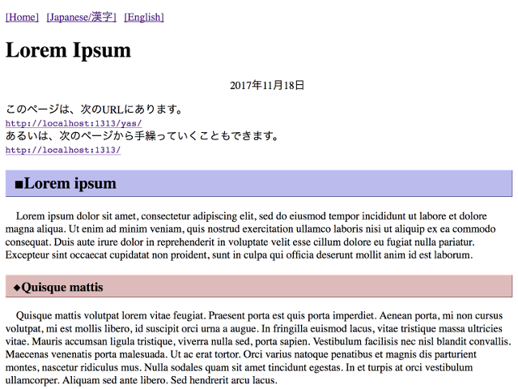

# yas-hugo
comfortable hugo theme



## Getting Started
Clone this repository to your hugo theme directory.

```sh
mkdir themes
cd themes
git clone https://github.com/glabra/yas-hugo.git
```

## Features
- Google Analytics supported
- Customizable header menu (through `[[menu.sitemenu]]`)

### `[[menu.sitemenu]]` syntax
```
[[menu.sitemenu]]
	name = "name"
	url = "https://example.com"
```

## License
yas-hugo is licensed under the [MIT License](LICENSE).

